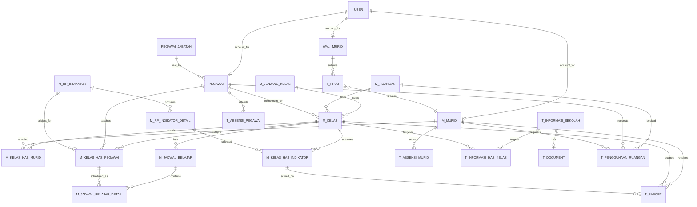

# ERD Specification

## Basis

This ERD was reverse-engineered from the implemented app, not from a formal FSD. Primary sources were:

- `zendekia (unicode, may 25, 2024).sql`
- `database/migrations/*.php`
- `Modules/DataPeserta/*`
- `Modules/DataPegawai/*`
- `Modules/DataRuangan/*`
- `Modules/RaportPesertaDidik/*`
- `Modules/Sekolah/*`
- `Modules/Absensi/*`

There is schema drift between the SQL dump and current code. Those gaps are called out below.

## Section 1: Entity Catalog

| Entity Name | Description | Type | Primary Key |
|---|---|---|---|
| User | Application login account | Strong | `id` |
| Role | Authorization role | Strong | `id` |
| Permission | Authorization permission | Strong | `id` |
| UserRole | User-role pivot | Weak | (`role_id`, `model_id`, `model_type`) |
| UserPermission | User-permission pivot | Weak | (`permission_id`, `model_id`, `model_type`) |
| RolePermission | Role-permission pivot | Weak | (`permission_id`, `role_id`) |
| MasterMenu | Navigation/menu tree | Strong | `id` |
| Pegawai | Employee/staff/teacher | Strong | `id` |
| PegawaiJabatan | Staff position/role master | Strong | `id` |
| PegawaiKontrak | Staff contract periods | Weak | `id` |
| PegawaiOther | Extra staff administrative data | Weak | `id` |
| PegawaiIndikator | Teacher-subject/indicator pivot | Weak | inferred composite |
| Murid | Student | Strong | `id` |
| WaliMurid | Guardian/parent | Strong | `id` |
| WaliMuridMurid | Guardian-student pivot | Weak | inferred composite |
| PpdbApplication | Admission/application record | Strong | `id` |
| JenjangKelas | Class level/grade master | Strong | `id` |
| Ruangan | Room/facility | Strong | `id` |
| Kelas | Class/homeroom | Strong | `id` |
| KelasMurid | Class-student enrollment | Weak | `id` |
| KelasPegawai | Class-teacher-subject assignment | Weak | `id` |
| JadwalBelajar | Semester schedule header | Strong | `id` |
| JadwalBelajarDetail | Weekly schedule slot | Weak | `id` |
| KelasHarian | Daily class journal/RKH | Strong | `id` |
| Tugas | Assignment/task | Strong | `id` |
| Indikator | Assessment/subject master | Strong | `id` |
| IndikatorDetail | Indicator detail item | Weak | `id` |
| KelasIndikator | Class-indicator detail pivot | Weak | `id` |
| Raport | Student score/report fact | Strong | `id` |
| AbsensiMurid | Student attendance | Strong | `id` |
| AbsensiPegawai | Staff attendance | Strong | `id` |
| InformasiSekolah | Announcement/information item | Strong | `id` |
| InformasiKelas | Announcement-class pivot | Weak | `id` |
| Document | Uploaded document metadata | Strong | `id` |
| PenggunaanRuangan | Room booking/usage | Strong | `id` |
| KategoriBarang | Inventory category | Strong | `id` |
| Barang | Inventory item master | Strong | `id` |
| Aset | Individual asset instance | Strong | `id` |
| PermintaanAset | Asset request header | Strong | `id` |
| PermintaanAsetDetail | Asset request line | Weak | `id` |
| PenerimaanBarang | Goods receipt header | Strong | `id` |
| PenerimaanBarangDetail | Goods receipt line | Weak | `id` |
| MutasiBarang | Stock/asset transfer header | Strong | `id` |
| MutasiBarangDetail | Stock/asset transfer line | Weak | `id` |
| Ekstrakurikuler | Extracurricular master | Strong | `id` |
| EkstrakurikulerMurid | Extracurricular-student pivot | Weak | `id` |
| EkstrakurikulerPegawai | Extracurricular-coach pivot | Weak | `id` |
| Blog | Teacher blog/article | Strong | `id` |
| Ebook | Learning ebook | Strong | `id` |
| Pelanggaran | Student discipline incident | Strong | `id` |
| ProfilSekolah | School profile/settings | Strong | `id` |
| GeneralSetting | Generic key-value settings | Strong | `id` |
| Province | External geographic reference | Strong | `id` |
| Regency | External geographic reference | Strong | `id` |
| District | External geographic reference | Strong | `id` |
| Village | External geographic reference | Strong | `id` |

## Section 2: Entity Details

### User

**Description:** Login identity for staff, students, and guardians

| Attribute | Data Type | Constraints | Description |
|---|---|---|---|
| id | bigint | PK | User id |
| name | varchar | NOT NULL | Display name |
| email | varchar | UNIQUE, NOT NULL | Login email |
| password | varchar | NOT NULL | Hashed password |
| user_type | enum | NULL | `Pegawai`, `Murid`, `Wali Murid` |
| user_type_id | bigint | NULL | Linked domain entity id |
| user_status | int | NOT NULL, default 1 | Active/inactive flag |
| user_phone | varchar | NULL | Phone |
| user_photo | varchar | NULL | Photo |
| email_verified_at | timestamp | NULL | Verification time |
| remember_token | varchar | NULL | Laravel auth token |
| created_at | timestamp | NULL | Audit |
| updated_at | timestamp | NULL | Audit |

### Pegawai

**Description:** Staff member, including teachers and non-teaching staff

| Attribute | Data Type | Constraints | Description |
|---|---|---|---|
| id | int | PK | Staff id |
| uuid | char(36) | UNIQUE | Public identifier |
| user_id | bigint | FK, NULL | Linked `User` |
| jabatan_id | int | FK, NULL | Linked `PegawaiJabatan` |
| nama | varchar | NULL | Full name |
| tipe_pegawai | enum | NULL | `Pengajar` / `Non-Pengajar` |
| nip | varchar | NULL | Employee id |
| email | varchar | NULL | Email |
| province_id | bigint | FK, NULL | Province ref |
| regency_id | bigint | FK, NULL | Regency ref |
| district_id | bigint | FK, NULL | District ref |
| village_id | bigint | FK, NULL | Village ref |
| kode_pos | varchar(20) | NULL | Postal code |
| status | tinyint | NULL | Active flag |
| deleted_at | timestamp | NULL | Soft delete |

### Murid

**Description:** Student master record

| Attribute | Data Type | Constraints | Description |
|---|---|---|---|
| id | int | PK | Student id |
| uuid | char(36) | UNIQUE | Public id |
| user_id | bigint | FK, NULL | Linked `User` |
| kelas_id | int | FK, NULL | Current class |
| no_rfid | varchar | NULL | RFID/scan code |
| nama_lengkap | varchar | NULL | Full name |
| nis | varchar | NULL | Student number |
| province_id | bigint | FK, NULL | Province ref |
| regency_id | bigint | FK, NULL | Regency ref |
| district_id | bigint | FK, NULL | District ref |
| village_id | bigint | FK, NULL | Village ref |
| kode_pos | varchar(20) | NULL | Postal code |
| flag_status | varchar | NULL | `draft`, `ppdb`, `murid`, `rejected` |
| flag_tahun_ajaran | year/int | NULL | Admission school year |
| status | tinyint | NULL | Active flag |
| deleted_at | timestamp | NULL | Soft delete |

### WaliMurid

**Description:** Parent/guardian

| Attribute | Data Type | Constraints | Description |
|---|---|---|---|
| id | int | PK | Guardian id |
| uuid | char(36) | UNIQUE | Public id |
| user_id | bigint | FK, NULL | Linked `User` |
| nama | varchar | NULL | Name |
| hubungan | varchar | NULL | Relationship to child |
| no_hp | varchar | NULL | Phone |
| province_id | bigint | FK, NULL | Province ref |
| regency_id | bigint | FK, NULL | Regency ref |
| district_id | bigint | FK, NULL | District ref |
| village_id | bigint | FK, NULL | Village ref |
| kode_pos | varchar(20) | NULL | Postal code |
| status | tinyint | NULL | Active flag |
| deleted_at | timestamp | NULL | Soft delete |

### PpdbApplication

**Description:** Admission application

| Attribute | Data Type | Constraints | Description |
|---|---|---|---|
| id | int | PK | Application id |
| uuid | char(36) | UNIQUE | Public id |
| wali_murid_id | int | FK, NULL | Guardian |
| murid_id | int | FK, NULL | Created student record |
| nama_lengkap | varchar | NULL | Applicant name |
| email | varchar | NULL | Applicant email |
| no_hp | varchar | NULL | Phone |
| note_reject | text | NULL | Rejection note |
| status | tinyint | NULL | Active flag |
| deleted_at | timestamp | NULL | Soft delete |

### Kelas

**Description:** Class/homeroom

| Attribute | Data Type | Constraints | Description |
|---|---|---|---|
| id | int | PK | Class id |
| uuid | char(36) | UNIQUE | Public id |
| jenjang_kelas_id | int | FK | Class level |
| ruangan_id | int | FK | Assigned room |
| pegawai_id | int | FK | Homeroom teacher |
| nama_kelas | varchar | NULL | Class name |
| tahun_ajaran | year/int | NULL | School year |
| status | tinyint | NULL | Active flag |
| deleted_at | timestamp | NULL | Soft delete |

### Ruangan

| Attribute | Data Type | Constraints | Description |
|---|---|---|---|
| id | int | PK | Room id |
| uuid | char(36) | UNIQUE | Public id |
| nama | varchar | NULL | Room name |
| tipe_ruangan | varchar | NULL | `Ruang Kelas` / `Fasilitas Sekolah` |
| status | tinyint | NULL | Active flag |

### Indikator

**Description:** Assessment/subject master used by report cards and teacher assignments

| Attribute | Data Type | Constraints | Description |
|---|---|---|---|
| id | int | PK | Indicator id |
| uuid | char(36) | UNIQUE | Public id |
| tipe | varchar | NULL | `KI-1`, `KI-2`, `KI-3`, `KI-4` |
| nama_tipe | varchar | NULL | Type grouping |
| nama | varchar | NULL | Indicator/subject name |
| data_order | int | NULL | Sort order |
| child_id | int | FK to `Indikator.id`, NULL | Linked child indicator |
| status | tinyint | NULL | Active flag |

### IndikatorDetail

| Attribute | Data Type | Constraints | Description |
|---|---|---|---|
| id | int | PK | Detail id |
| indikator_id | int | FK | Parent indicator |
| nama | varchar | NULL | Detail statement |

### Raport

| Attribute | Data Type | Constraints | Description |
|---|---|---|---|
| id | int | PK | Score id |
| murid_id | int | FK | Student |
| kelas_has_indikator_id | int | FK | Class indicator detail |
| semester | tinyint/int | NOT NULL | Semester |
| kelas_id | int | FK | Class |
| nilai | numeric/int | NULL | Score |
| tipe_penilaian | tinyint | NOT NULL | Assessment type code |
| status | tinyint | NULL | Active flag |

### AbsensiMurid

| Attribute | Data Type | Constraints | Description |
|---|---|---|---|
| id | int | PK | Attendance id |
| murid_id | int | FK | Student |
| tanggal | date | NULL | Date |
| jam_masuk | time | NULL | Check-in |
| jam_keluar | time | NULL | Check-out |

### InformasiSekolah

| Attribute | Data Type | Constraints | Description |
|---|---|---|---|
| id | int | PK | Info id |
| uuid | char(36) | UNIQUE | Public id |
| judul | varchar | NULL | Title |
| type | varchar(30) | NULL | Info type |
| informasi_tanggal | date | NULL | Publish/event date |
| foto_cover | text | NULL | Cover image |
| konten | text | NULL | Content |
| status_approve | tinyint | default 0 | Approval flag |
| status | tinyint | NULL | Active flag |

### Document

| Attribute | Data Type | Constraints | Description |
|---|---|---|---|
| id | int | PK | Document id |
| uuid | char(36) | UNIQUE | Public id |
| source | varchar | NULL | Source module |
| file_name | varchar | NULL | Stored filename |
| extension | varchar | NULL | Extension |
| file_path | varchar | NULL | Path/url |
| pelanggaran_id | int | FK, NULL | Discipline incident |
| informasi_sekolah_id | int | FK, NULL | Announcement |
| status | tinyint | NULL | Active flag |

### PenggunaanRuangan

| Attribute | Data Type | Constraints | Description |
|---|---|---|---|
| id | int | PK | Booking id |
| uuid | char(36) | UNIQUE | Public id |
| pegawai_id | int | FK, NULL | Staff requester |
| murid_id | int | FK, NULL | Student requester |
| ruangan_id | int | FK | Room |
| keterangan | text | NULL | Purpose/notes |
| start_date | date | NULL | Start date |
| start_time | time | NULL | Start time |
| end_date | date | NULL | End date |
| end_time | time | NULL | End time |
| use_date | datetime | NULL | Combined start datetime |
| finish_date | datetime | NULL | Combined end datetime |
| status | tinyint | NULL | Active flag |

## Section 3: Relationship Specifications

| Relationship | Entity A | Entity B | Cardinality | Participation | Description |
|---|---|---|---|---|---|
| has account | Pegawai | User | 1:0..1 | Partial | Staff may have one login |
| has account | Murid | User | 1:0..1 | Partial | Student may have one login |
| has account | WaliMurid | User | 1:0..1 | Partial | Guardian may have one login |
| assigned role | User | Role | M:N | Partial | Via `model_has_roles` |
| granted permission | User | Permission | M:N | Partial | Via `model_has_permissions` |
| grants permission | Role | Permission | M:N | Partial | Via `role_has_permissions` |
| holds position | Pegawai | PegawaiJabatan | N:1 | Partial | Staff has one position |
| teaches indicator | Pegawai | Indikator | M:N | Partial | Teacher competency/subject assignment |
| guards | WaliMurid | Murid | M:N | Total on pivot | Via `m_wali_murid_has_murid` |
| submits application for | WaliMurid | PpdbApplication | 1:N | Partial | Guardian owns applications |
| creates student record | PpdbApplication | Murid | 1:0..1 | Partial | Application may map to created student |
| belongs to level | Kelas | JenjangKelas | N:1 | Total | Every class has a level |
| uses room | Kelas | Ruangan | N:1 | Total | Every class uses one room |
| homeroomed by | Kelas | Pegawai | N:1 | Total | Every class has one homeroom teacher |
| enrolls | Kelas | Murid | M:N | Partial | Via `m_kelas_has_murid` |
| assigns teacher | Kelas | Pegawai | M:N | Partial | Via `m_kelas_has_pegawai` |
| assigns subject | KelasPegawai | Indikator | N:1 | Total | Teacher assignment is for one indicator |
| has schedules | Kelas | JadwalBelajar | 1:N | Partial | Semester schedule headers |
| has schedule slots | JadwalBelajar | JadwalBelajarDetail | 1:N | Total | Slot rows |
| references class teacher assignment | JadwalBelajarDetail | KelasPegawai | N:1 | Total | Slot mapped to teacher-subject |
| has journals | Kelas | KelasHarian | 1:N | Partial | Daily journals |
| has tasks | KelasPegawai | Tugas | 1:N | Partial | Teacher-subject assignments create tasks |
| has details | Indikator | IndikatorDetail | 1:N | Total | Detail statements under indicator |
| activates detail | Kelas | IndikatorDetail | M:N | Partial | Via `m_kelas_has_indikator` |
| scores | Murid | Raport | 1:N | Partial | Student has many score facts |
| scores against | Raport | KelasIndikator | N:1 | Total | Score row points to class indicator detail |
| belongs to class | Raport | Kelas | N:1 | Total | Score scoped to class |
| attends | Murid | AbsensiMurid | 1:N | Partial | Student attendance facts |
| attends | Pegawai | AbsensiPegawai | 1:N | Partial | Staff attendance facts |
| targets class | InformasiSekolah | Kelas | M:N | Partial | Via `t_informasi_has_kelas` |
| has document | InformasiSekolah | Document | 1:0..1 | Partial | Optional attachment |
| books | Pegawai | PenggunaanRuangan | 1:N | Partial | Staff room usage |
| books | Murid | PenggunaanRuangan | 1:N | Partial | Student room usage |
| books room | PenggunaanRuangan | Ruangan | N:1 | Total | Booking targets one room |

## Section 4: ERD Notation

## Section 5: Design Decisions & Notes

- Treat the current codebase as truth, not the SQL dump alone.
- Standardize on current names:
  - `t_penggunaan_ruangan` instead of dump typo `t_pengunaan_ruangan`
  - `indikator_id` instead of old `mata_pelajaran_id`
  - `m_pegawai_has_indikator` instead of old `m_pegawai_has_subjek`
- Keep `User` separate from domain tables.
- Keep `KelasHasPegawai` and `KelasHasIndikator` as explicit junction tables.
- `Raport` should remain a fact table.
- `PenggunaanRuangan` should keep both split date/time columns and combined datetime columns.

## Important ambiguities to resolve before cloning

1. `m_rp_indikator`, `m_rp_indikator_detail`, `t_raport`, `m_kelas_has_indikator`, `m_jenjang_kelas`, and `t_rkh` are used by code but not fully defined in the SQL dump.
2. `Murid.no_rfid`, `Murid.flag_status`, `Murid.flag_tahun_ajaran`, `PenggunaanRuangan.use_date`, `finish_date`, `Ruangan.tipe_ruangan`, and several `InformasiSekolah` fields are code-driven newer columns.
3. Inventory, Akademi, Chat, Event, Keuangan, and Transaksi are partially implemented.
4. Geographic master tables are external dependencies.

## Clone Recommendation

For a safe clone MVP, build these first:

1. `User`, `Role`, `Permission`, `MasterMenu`
2. `Pegawai`, `PegawaiJabatan`, `Murid`, `WaliMurid`, `PpdbApplication`
3. `JenjangKelas`, `Ruangan`, `Kelas`, `KelasMurid`, `KelasPegawai`
4. `Indikator`, `IndikatorDetail`, `KelasIndikator`, `JadwalBelajar`, `JadwalBelajarDetail`
5. `Raport`, `AbsensiMurid`, `InformasiSekolah`, `Document`, `PenggunaanRuangan`
